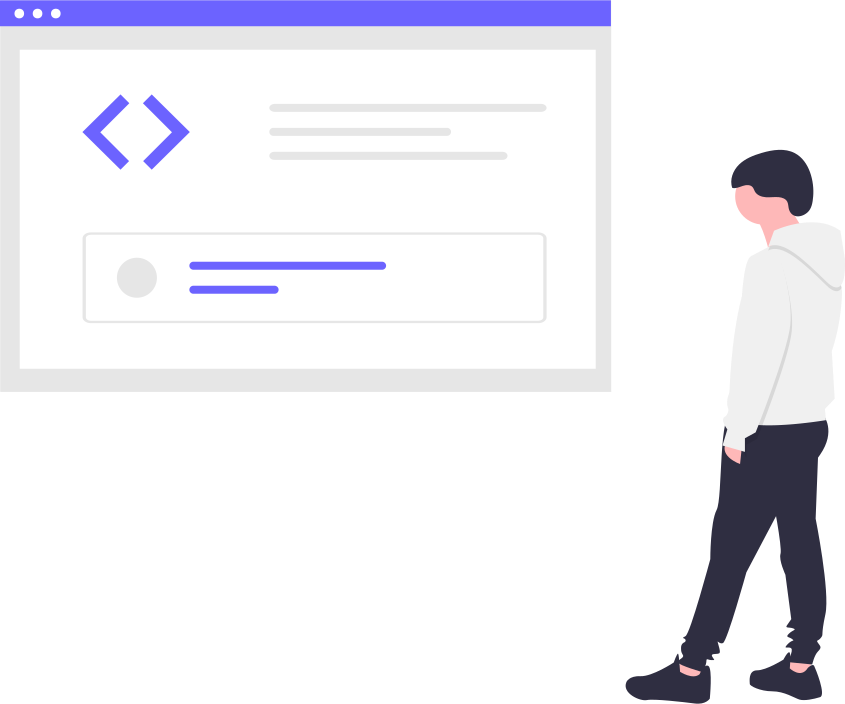
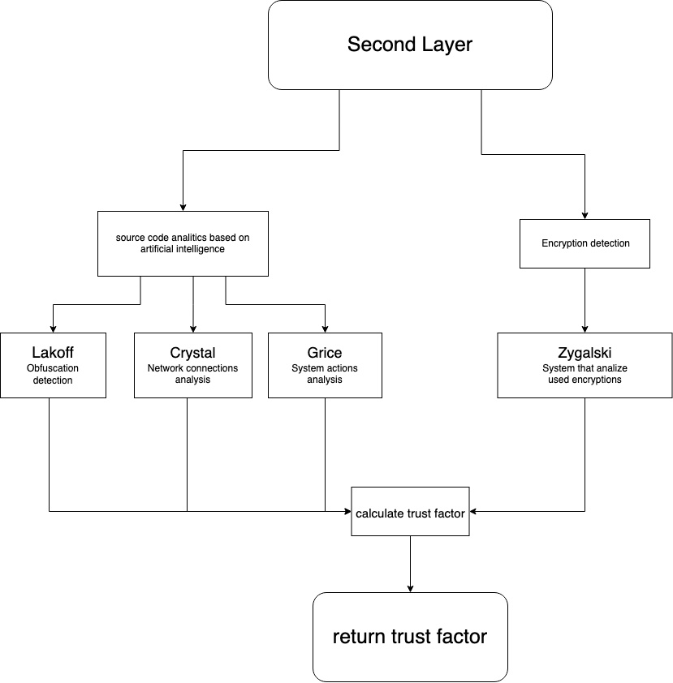

# Meerkat Engine II Layer 

In the second stage, Meerkat performs static analysis of the source code in commit and project context.
The second layer engine calculates code security factors depending on the:
1. [source code analytics based on artificial intelligence](#Artifical_Intelligance)
2. [used function and syscalls](#functions_and_syscalls)
3. [code obfuscation and encryption](#obfuscation_and_encryption)
  

## Artificial Intelligence  
 
  
   

Trust factor depends on the language, framework and project schema.
For example, it is highly suspicious when web applications execute some of the user data as a system command, or native offline application use CURL / ASIO functions.
  
In layer two we use three artificial intelligence models from the outputs of the 3 AI models named:
1. **Lakoff - Obfuscation detection.**  
    When obfuscation will be detected our engine will do its best to deobfuscate and analyze a given part of code.  
      
2. **Crystal -  analysis of the suspicious network/cloud connections**  
    Crystal analyze performed network/cloud connections and how they were implemented.  
    Networking is one of the most important elements in this puzzle that allows an attacker to communicate with the hidden backdoor.    
    The main methods are the usage of the following: 
    - Documented and undocumented syscalls like:  
    **SWSASocketA, DnsQueryEx, InternetOpenA, SYS_SOCKETCALL**
    - The function implemented in popular libraries that look less suspicious in code review:
    **AWS/Azure/Gcloud SDK, Qt, Curl, Asio**
    - Usage of the cloud:  
    actions performed on the cloud infrastructure like:  
    **SNS, Aurora, S3 bucket, Kubernetes** and more...   

3. **Grice - analysis of the suspicious action performed on the system**   
    PGrice analyses actions performed at the host system and how they were implemented. 
    The main goal is to detect: **potential process injection, RCE, malware dropping, keylogging, destructive behaviour, and crypto mining.** 
    - Documented and undocumented syscalls like:  
    ReadProcessMemory, WriteProcessMemory, GetKeyState, OpenProcess  
    - Usage of the function implemented in popular libraries to look less suspicious during code review:  
    **QT SimpleCrypt, and QKeyEvent, are some of the boost functions**

   
## Tech stack

Technologies:  
- [Tensorflow](https://www.tensorflow.org/)  
- [GPT-3](https://huggingface.co/)  
- [Python 3.10](https://www.python.org/)

Model bazowy: [GPT2](https://huggingface.co/gpt2)  
Modele do trenowania sieci (pozytywne podatne, negatywne nie podatne)  
negatywne:  
- 150tysiecy plikow pythona z roznych repozytoriow (wstepnie obrobione): https://www.sri.inf.ethz.ch/py150  
- pull requesty (można napisać tool który zescrapuje kod ktory byl mergowany): https://www.kaggle.com/datasets/stephangarland/ghtorrent-pull-requests  
  
pozytywne:  
- nasze wlasne repozytorium treningowe  
- probki malwareu ????  
