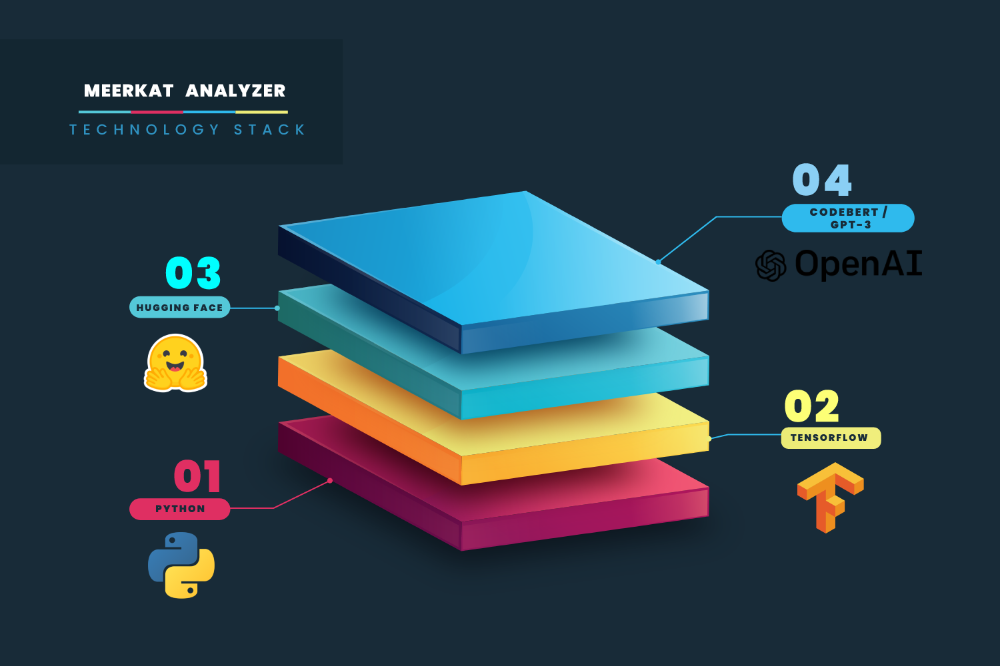

# Meerkat Engine II Layer

 
  
    

The trust factor calculated at the second layer depends on the used functions/libraries according to language, framework and project schema.  
For example, it is highly suspicious when web applications execute some of the user data as a system command, or when the native offline application use CURL / ASIO functions.

Layer two analysis is split into the three main parts:
1. [source code analytics based on artificial intelligence](#Artifical_Intelligance)
2. [used function and syscalls](#functions_and_syscalls)
3. [code obfuscation and encryption](#obfuscation_and_encryption)
  

## Artificial Intelligence  
  
   

  

In layer two we use three artificial intelligence models to calculate the trust factor:
1. **Lakoff - Obfuscation detection.**  
    When obfuscation will be detected our engine will do its best to deobfuscate and analyze a given part of the code.  
      
2. **Crystal -  analysis of the suspicious network/cloud connections**  
    Crystal analyze performed network/cloud connections and how they were implemented.  
    Networking is one of the most important elements in this puzzle that allows an attacker to communicate with the hidden backdoor.    
    The main methods are the usage of the following: 
    - Documented and undocumented syscalls like:  
    **SWSASocketA, DnsQueryEx, InternetOpenA, SYS_SOCKETCALL**
    - The function implemented in popular libraries that look less suspicious in code review:
    **AWS/Azure/Gcloud SDK, Qt, Curl, Asio**
    - Usage of the cloud services:  
    actions performed on the cloud infrastructure like:  
    **SNS, Aurora, S3 bucket, Kubernetes** and more...   

3. **Grice - analysis of the suspicious action performed on the system**   
    Grice analysis actions performed at the host system and how they were implemented. 
    The main goal is to detect: **potential process injection, RCE, malware dropping, keylogging, destructive behaviour, and crypto mining.** 
    - Documented and undocumented syscalls like:  
    ReadProcessMemory, WriteProcessMemory, GetKeyState, OpenProcess  
    - Usage of the function implemented in popular libraries to look less suspicious during code review:  
    **QT SimpleCrypt, QKeyEvent and some of the boost functions**  
  
   

# Encryption detection:
This method is dedicated to mitigating all of the ransomware and crypto miners' injections.

If Meerkat detects string encryption it will try:
1. Detect the type of encryption (hashing, symmetric, asymmetric)
2. Check if the used encryption is necessary in your application (for example password hashing in the web application)
